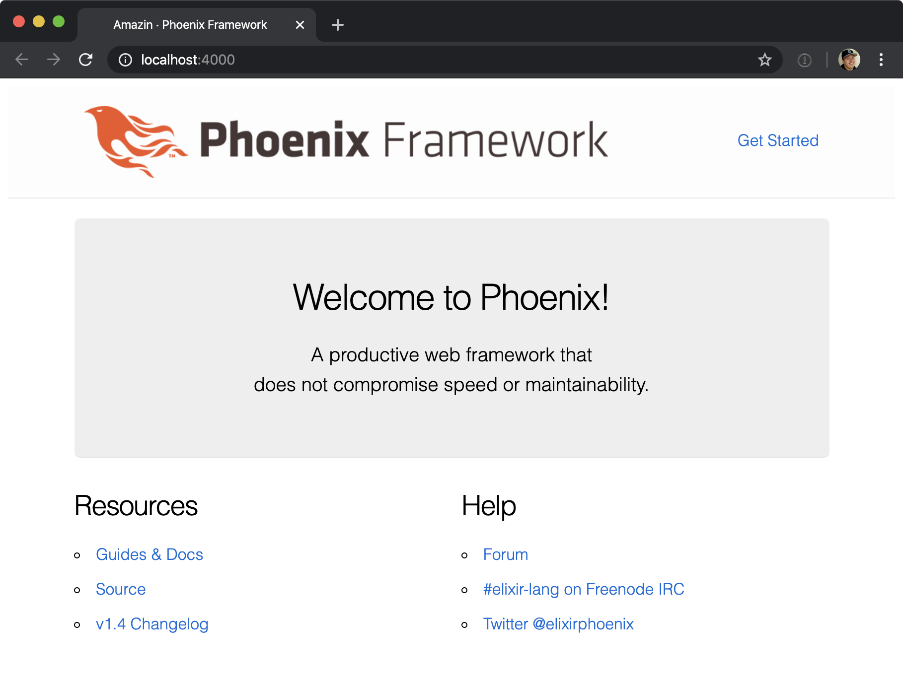

I'm gunna build a real time ecomerce application powered by stripe and phoenix live view.
The goal here is to show the power of reactive programming in elixir and how simple it is to build
great user experiences with phoenix.

We're going to use an event based system to provide real time updates to each user using the application.

## Tech used

- Stripe
- Elixir
- Phoneix Framework
- Phoenix Live View
- Postgres

## Prerequisites

- Basic elixir understanding

For the first example, we're going to show a remaining item count to users.

1. Create a new phoenix app.
   [See Docs](https://www.phoenixframework.org/)
   > Assuming you've already installed elixir.

```bash
mix phx.new amazin
```

Repo on [Github](https://github.com/tylerwray/amazin)

1. Setup Database

First we need to setup our database. You'll need to have a postgres database running on your computer to do this to do this.
For now, I'm using [Postgres.app](https://postgresapp.com/) on my mac to run postgres, and the wonderful
client for MacOS, [Postico](https://eggerapps.at/postico/) (both made by the same wonderful people, [EggerApps](https://eggerapps.at/about.html) 😍).

Now we should be able to setup our database.

```bash
mix ecto.create
```

If you connect to that DB with postico, you'll see we now have a database called `amazin_dev`

1. Start the darn thing!
   Now we can start our pheonix application and see the default pages.

```bash
mix phx.server
```

Open `http://localhost:4000`



1. Install phoenix live view
   Phoenix live view is still under _very_ active development, and things can change quickly.
   It's likely this post will be out of date by the time you read it.
   This is just a word to the wise that this is very new, young, and cool tech.

   I just followed the installation guide [here](https://hexdocs.pm/phoenix_live_view/installation.html) for pheonix live view.

1. Setup account in stripe.
   Go to the [registration page](https://dashboard.stripe.com/register) for stripe and signup for an account.
   Then you'll be taken into the stripe dashboard!
   

1. Install Stripe elixir client

We will use a nice client for communicating with the stripe API. I'm using [stripity_stripe](https://github.com/code-corps/stripity_stripe) because I feel
like it has the most polish out of the options available.

Add it to your dependencies, and run `mix deps.get`.

```elixir
def deps do
  [
    {:stripity_stripe, "~> 2.0.0"}
  ]
end
```

In order to communicate with stripe, we need an api key. You can grab the test api secret key from the [stripe developer page](https://dashboard.stripe.com/test/apikeys).

Once you have it, you'll need to load it someone, I like to create a `config/dev.secret.exs` file, and load it in my dev config `config/dev.exs` with this line at the bottom:

```elixir
import_config "dev.secret.exs"
```

And don't forget to add `config/dev.secret.exs` to your `.gitignore`!

Inside that `config/dev.secret.exs` file, you can now safely add the api key from stripe:

```elixir
use Mix.Config

config :stripity_stripe, api_key: "YOUR_SECRET_KEY"
```

Now you should be able to communicate with stripe! Let's test that out.
Start an interactive session of your application with:

```bash
iex -S mix
```

Then inside iex, run:

```elixir
iex(1)> Stripe.Customer.list
```

and you should see something like:

```elixir
{:ok,
 %Stripe.List{
   data: [],
   has_more: false,
   object: "list",
   total_count: nil,
   url: "/v1/customers"
 }}
```

And with that we are all setup!

Next up, we will work on displaying some data with live view, and updating that view based on events receieved from stripe.
