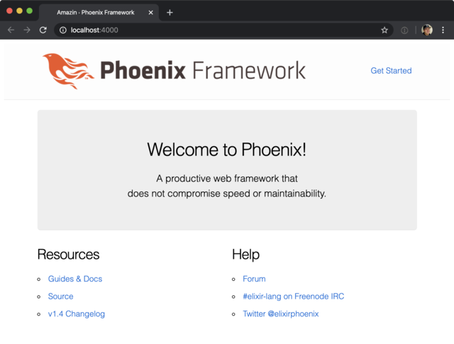

I've heard alot about [Phoenix LiveView](https://github.com/phoenixframework/phoenix_live_view) from co-workers and twitter,
so I wanted to actually build something with it to really test it out. At it's core, Phoenix LiveView is a framework for writing
real-time UI's in a declarative fashion, using a programming langauage loved by many; [Elixir](https://elixir-lang.org/).

We're going to build an ecommerce application powered by [Stripe](https://stripe.com) and Phoenix LiveView. Along the way learning
about the problems Phoenix LiveView solves, some basics of Stripe, cool tailwindcss features, and a bit about reactive programming,

This is going to be fun, let's dive in.

## Create a New Phoenix App

Use [this guide](https://hexdocs.pm/phoenix/installation.html#content) in the
phoenix docs to get Elixir, Erlang, Phoneix, NodeJS, and PostgreSQL setup.
Thats alot, but trust me it's worth it 🥇.

> If you're running macOS, I highly recommend [Postgres.app](https://postgresapp.com/) to
> run postgres, and [Postico](https://eggerapps.at/postico/) as a nice GUI client.
> Both made by the same wonderful people, at [EggerApps](https://eggerapps.at/about.html) 😍.

Once you have everything setup, let's run this command to create our application.

```bash
mix phx.new amazin --live
```

Choose `yes` to install dependencies and follow the instructions to start the app.

Once running, let's open [`http://localhost:4000`](http://localhost:4000) to see
the phoenix welcome page 😎.



## Stripe Account Setup

We will need a stripe account to use for our application.

If you have one, login now because we will need our API keys coming up soon.
If you don't, go create one on the [registration page](https://dashboard.stripe.com/register).

## Install Dependencies

We're going to need two elixir dependencies for our application:

1. [stripity_stripe](https://github.com/code-corps/stripity_stripe): A client library
   for working with the stripe API.
2. [Money](https://hexdocs.pm/money/Money.html): A currency formatter.

Add them to your deps in `mix.exs`

```elixir
def deps do
  [
    {:stripity_stripe, "~> 2.0.0"},
    {:money, "~> 1.4"}
  ]
end
```

Then run

```bash
mix deps.get
```

Next we need to setup [tailwindcss](https://tailwindcss.com/) to work with liveview.
I really like tailwind as a companion to liveview because of it's utility-first nature.
It makes it really easy to style our live views and components.

First we need to install some Javascript modules.

```bash
npm install --prefix assets postcss-loader tailwindcss
```

## Configuration

We need to add a couple pieces of configuration. We need to tell `stripity_stripe`
what our Stripe API key is. We need to tell our Money package which currency to
use as a default. And lastly we need to tell webpack how to include tailwindcss.
You can grab the Stripe API secret key from the
[stripe developer page](https://dashboard.stripe.com/apikeys) of your stripe account.
Take great care with this key, like the name says, it's secret 🤫

Once you have your API key, create a new file: `config/dev.secret.exs`.

Inside that `config/dev.secret.exs` file, you can now safely add the api key from stripe:

```elixir
use Mix.Config

config :stripity_stripe, api_key: "YOUR_SECRET_KEY"
```

And don't forget to add `config/dev.secret.exs` to your `.gitignore`!

Now in the main configuration file we are going to give our default currency. I'm using
USD, but you can use any currency you'd like. A full list can be
found [in the docs of Money](https://hexdocs.pm/money/Money.Currency.html#content).

```elixir
# config/config.exs

config :money, default_currency: :USD
```

Then in our dev configuration we are going to load our secret file. Make sure to put
this at the very bottom of `config/dev.exs`

```elixir
import_config "dev.secret.exs"
```

Now for tailwindcss configuration. This is going to the be the most javascript
you write in this guide, I promise. We're using [`postcss-loader`](https://postcss.org/)
to load tailwind, so lets do that by creating a new file at `assets/postcss.config.js`
with the contents:

```javascript
module.exports = {
  plugins: [require("tailwindcss")],
}
```

Then add the `postcss-loader` to the css rule in `assets/webpack.config.js`

```git
{
  test: /\.[s]?css$/,
  use: [
    MiniCssExtractPlugin.loader,
    "css-loader",
    "sass-loader",
    "postcss-loader",
  ],
}
```

## Testing it all out

Now you should be able to start the app and communicate with stripe!
Let's test that out. Start an interactive session of your application with:

```bash
iex -S mix
```

Then inside iex, run:

```elixir
iex(1)> Stripe.Customer.list
```

and you should see something like:

```elixir
{:ok,
 %Stripe.List{
   data: [],
   has_more: false,
   object: "list",
   total_count: nil,
   url: "/v1/customers"
 }}
```

And with that we are all setup! Now the fun begins 😈

## Navbar

We are going to create our first simple live view;
A basic navbar with product cards, each showing a live inventory count.

First thing we need to do is setup our root layout properly. And that starts with
adding our nice logo.

<div class="bg-gray-800">
  
</div>

<a href="/amazin-logo.svg" download>Click here to Download logo</a>

Place that logo in `assets/static/images/logo.svg`.

Then head over to `lib/amazin_web/templates/layout/root.html.leex` and replace the
contents of the `<body />` tag so it looks like this:

```html
<body>
  <nav class="bg-gray-800">
    <div class="px-4 flex items-center">
      
      <a href="/" class="px-3 py-2 rounded text-white bg-gray-900">PRODUCTS</a>
    </div>
  </nav>
  <%= @inner_content %>
</body>
```

## Generate a Live view

Now we are going to create a new live view using the built in generators
that come with phoenix. If you haven't seen anything like this before,
it may blow your mind.

```bash
mix phx.gen.live Inventory Product products cost:integer description:string name:string stock:integer thumbnail:string upc:string:unique
```

This creates a context called `Inventory`, with a schema called `Product`,
using a table called `products`, with the remaining arguments describing
the data of a `Product`.

> Feel free to explore those files it created and get familiar with them.
> We will be going in and making edits to some of them later.

The generator output shows us all the files it created, instructs us to make
some updates to our router, and run migrations. Let's do that really quick.

```git
scope "/", AmazinWeb do
  pipe_through :browser

+  live "/products", ProductLive.Index, :index
+  live "/products/new", ProductLive.Index, :new
+  live "/products/:id/edit", ProductLive.Index, :edit

+  live "/products/:id", ProductLive.Show, :show
+  live "/products/:id/show/edit", ProductLive.Show, :edit
end
```

Then run:

```bash
mix ecto.migrate
```

Lastly, we need to make one small change to the `cost` field in
`lib/amazin/inventory/product.ex`.

```git
-    field :cost, :integer
+    field :cost, Money.Ecto.Amount.Type
```

Using the `Money.Ecto.Amount.Type` here, we get automatic currency formatting 🙌🏻.

## Custom products grid

Now we're going make things our own and use the awesome power of tailwindcss. First,
we need to get rid of the default phoenix styles so we can have more control over the UI.
Replace all of `assets/css/app.scss` with this:

```css
@import "../node_modules/nprogress/nprogress.css";

@tailwind base;

@tailwind components;

@tailwind utilities;
```

Small one, but remove `class="container"` from the `<main />` tag
in `lib/amazin_web/templates/layout/live.html.eex`, because it conflicts
with the tailwindcss container class. Now its time to make our product list prettier.  
Replace all of `lib/amazin_web/live/product_live/index.html.leex` with

```html
<div class="grid grid-cols-4 gap-12 p-12">
  <%= for product <- @products do %>
  <div class="flex flex-col bg-white border border-gray-400 shadow rounded-lg">
    "
      title="<%= product.name %>"
      alt="<%= product.name %>"
    />
    <div class="px-6 py-4 border-t border-gray-400">
      <h3 class="text-lg leading-6 font-medium text-gray-900">
        <%= product.name %>
      </h3>
      <p class="text-sm text-gray-500">
        <%= product.description %>
      </p>
    </div>
    <div class="px-6 py-4 border-t border-gray-400 text-xl">
      <%= product.stock %> remaining
    </div>
    <div class="p-6 py-4 border-t border-gray-400 text-xl">
      <div class="flex flex-col items-left">
        <%= product.cost %>
        <button
          phx-click="add_to_cart"
          phx-value-upc="<%= product.upc %>"
          class="focus:outline-none focus:shadow-outline text-sm bg-blue-500 hover:bg-blue-600 text-white py-2 px-4 mt-2 rounded"
        >
          Add to Cart
        </button>
      </div>
    </div>
  </div>
  <% end %>
</div>
```

Let's seed our DB with some better data. Let's add the following to `priv/repo/seeds.exs`

<details>
  <summary>Click to expand</summary>

```elixir
alias Amazin.Repo
alias Amazin.Inventory.Product

Repo.insert!(%Product{
  cost: 1295,
  description: "Louisville Slugger premium pine bat.",
  name: "Baseball Bat",
  stock: 10,
  thumbnail: "https://tshop.r10s.com/f32/0d1/b97c/5c3b/a03f/784b/c58d/11e6e999130242ac110004.jpg",
  upc: "000000000000"
})

Repo.insert!(%Product{
  cost: 1295,
  description: "Nike made barcelona soccer ball.",
  name: "Soccer ball",
  stock: 9,
  thumbnail:
    "https://www.soccermaster.com/wp-content/uploads/sc3500_610_nike_barca_20_years_prestige_ball_sm_01.jpg",
  upc: "111111111111"
})

Repo.insert!(%Product{
  cost: 8995,
  description: "Wilson made NFL edition ball.",
  name: "Football",
  stock: 8,
  thumbnail:
    "https://dks.scene7.com/is/image/GolfGalaxy/16WILUNFLGMBLLFFCFTB?qlt=70&wid=600&fmt=pjpeg",
  upc: "222222222222"
})

Repo.insert!(%Product{
  cost: 6995,
  description: "Spalding made NBA edition ball.",
  name: "Basketball",
  stock: 7,
  thumbnail:
    "https://encrypted-tbn0.gstatic.com/images?q=tbn%3AANd9GcTMDLpR4ALSBJtVOBvcyJ9aLQxs-lw0Fw1fPnPKYFKweJwSK59eEbpYQ62xoycotREN77aAB9JY&usqp=CAc",
  upc: "333333333333"
})

Repo.insert!(%Product{
  cost: 12399,
  description: "StringKing Complete 2 Pro Offense Womens Lacrosse Stick | Bar Down Lacrosse",
  name: "Lacrosse Stick",
  stock: 6,
  thumbnail:
    "https://upload.wikimedia.org/wikipedia/commons/thumb/4/4e/Crossed_lacrosse_sticks_skinny.svg/1200px-Crossed_lacrosse_sticks_skinny.svg.png",
  upc: "444444444444"
})

Repo.insert!(%Product{
  cost: 24995,
  description: "American Athletic Shoe Women's Leather Lined Ice Skates",
  name: "Ice Skates",
  stock: 5,
  thumbnail: "https://images-na.ssl-images-amazon.com/images/I/31vmND6WbEL._AC_.jpg",
  upc: "555555555555"
})

Repo.insert!(%Product{
  cost: 799,
  description: "Penn Extra-Duty Championship Tennis Balls",
  name: "Tennis balls",
  stock: 4,
  thumbnail:
    "https://www.gophersport.com/cmsstatic/img/117/G-51119-PennExtra-DutyChampionship-ce-11.jpg",
  upc: "666666666666"
})

Repo.insert!(%Product{
  cost: 8799,
  description: "Surgeon RX3.1 Ice Hockey Stick",
  name: "Hockey Stick",
  stock: 3,
  thumbnail:
    "https://www.stx.com/media/catalog/product/cache/c7d685abe37f4d15c439fdc154c3cbf1/s/u/surgeon_rx3.1_front.png",
  upc: "777777777777"
})

Repo.insert!(%Product{
  cost: 18549,
  description: "Kyrie 6 'Enlightenment' Basketball Shoe",
  name: "Basketball Shoes",
  stock: 2,
  thumbnail:
    "https://static.nike.com/a/images/t_PDP_1280_v1/f_auto/cd6f7b5f-ad1d-48a8-b129-1f9d3f1bf72e/kyrie-6-enlightenment-basketball-shoe-1zgG18.jpg",
  upc: "888888888888"
})

Repo.insert!(%Product{
  cost: 38549,
  description:
    "Ram Golf Accubar 16pc Golf Clubs Set - Graphite Shafted Woods, Steel Shafted Irons - Mens Right Hand",
  name: "Golf Clubs",
  stock: 1,
  thumbnail:
    "https://res-1.cloudinary.com/s247/image/upload/c_pad,dpr_1.0,f_auto,h_800,q_auto,w_800/media/catalog/product/r/a/ram_16pc_mensrh_2.jpg",
  upc: "999999999999"
})
```

</details>

<br />

Then run

```bash
mix run priv/repo/seeds.exs
```

Finally, if you start up the server again and go to
[`http://localhost:4000/products`](http://localhost:4000/products),
you should see a wonderful little grid of all your products 🥰


## Live Updates

Now we want to make that "remaining" number update when users checkout
and we're going to use [Phoenix.PubSub](https://hexdocs.pm/phoenix_pubsub/Phoenix.PubSub.html) to do it.

### Accomplishments 🏆

- Setup a new phoenix live view app
- Setup tailwindcss for proper user in our phoenix app
- Setup a stripe account and made API calls with elixir
- Learned about phoenix generators
- Built our first live view
- Built some awesome UI tailwindcss

### Tech used 💻

- Elixir
- Phoenix Framework
- Postgres
- Tailwindcss
