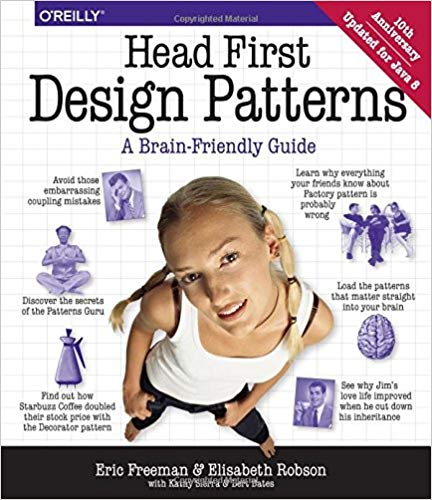

Photo by [Imthaz Ahamed](https://unsplash.com/photos/vVLrfAzmWYw?utm_source=unsplash&utm_medium=referral&utm_content=creditCopyText) on [Unsplash](https://unsplash.com/search/photos/patterns?utm_source=unsplash&utm_medium=referral&utm_content=creditCopyText)

I've been working with React for 3 1/2 now. I started out resisting React
(I wanted to use Angular because the [M.E.A.N](http://meanjs.org/) stack was all the rage)
My co-worker convinced me to try out React because it was already setup and we had a deadline 🤷🏻‍♂️

At the time I was REALLY into separation of concerns. I was reading a Design Patterns book and
was begining to form my own opinions on things 🤓



> Great book, worth the read

### Inheritance

Having just read a wondeful book that I took as law, I was frustrated with React's inclusion of Markup inside of Javascript.
"They must be separate!" said the _S_ in S.O.L.I.D.!
And so I immidiately disliked React

We had a deadline to meet so I accepted React and worked with it the best I could. Again having just read this awesome book
on design patterns, I wanted to apply my knowledge and earn my keep! So I genericized code, made it _DRY_, and wrote some of
the worst code I have EVER written. I broke the number one React rule, I made a component base class 🙈
It looked something like this

```jsx
class Base extends React.Component {
  async componentDidMount() {
    const data = await apiCall(this.props.type)
    this.setState({ data })
  }

  render() {
    throw new Error("SHOULD NEVER GET HERE")
  }
}

class Widget extends Base {
  render() {
    return <div>{this.state.data.title}</div>
  }
}
```

> This probably even looks better than it did

How to you avoid this? **DON'T DO IT.** The funny thing is, [React has explicit warnings against this!](https://reactjs.org/docs/composition-vs-inheritance.html)

Read the docs people.

### Prop Madness

I'm pretty sure eveyone runs into this problem in React. I call it _Prop Madness_.
Here is an example

```jsx
function Outer({ data, onHover, onClick, onSaveInner }) {
  return (
    <Inner
      title={data.title}
      date={data.date}
      isTesting={data.isTesting}
      text={data.text}
      actionButtonTitle={data.actionButtonTitle}
      onHover={onHover}
      onClick={onClick}
      onSaveInner={onSaveInner}
    />
  )
}

function Inner({ title, date, isTesting, onHover, onClick }) {
  // Do stuff ...
}
```

It sometimes get's remedied like this

```jsx
function Outer({ data, onHover, onClick, onSaveInner }) {
  return <Inner {...data} onHover={onHover} onSaveInner={onSaveInner} />
}

function Inner({ title, date, isTesting, onHover, onClick }) {
  // Do stuff ...
}
```

Problem solved! Right?

**Nope.**

We've masked the problem, but haven't really solved it. Now any extra properties on the data object get passed
to the `<Inner />` component when they don't need to! And what happens when some of those props become optional? When the `<Inner />`
component wants to rename one of those props?

Also notice how the `<Outer />` component doesn't actually use any of the props, it just passes them along!

This approach couples the two components together, you may as well inline the `<Inner />` component inside the `<Outer />`

React created a built-in approach to solving this problem. It's called [Context](https://reactjs.org/docs/context.html)

Context can solve this problem quite nicely, and I recommend learning the api. However, if you use something like Redux, Apollo, Relay, MobX,
or anything similar, keep in mind the next Anti-pattern.

### Component splitting

Too often I see code that is over-abstracted and split up into pieces that are too small. Not just in React either. Often I see
`/utils` folders that hold all the business logic and each _"utility"_ is only used in one other place. It's misdirection, and it hurts
code readability. We have the same problem in React.

Our Prophet, Dan Abramov, recently made an adendumn to his post on [Presentational vs Container Components](https://medium.com/@dan_abramov/smart-and-dumb-components-7ca2f9a7c7d0)
stating that his separation like this can be harmful when taken too seriously.

I live by the following mantra:

_A component is a component_

Simple right? The idea is that for most cases, we don't need to separate concerns and make some components just focused on _styles_ 💅, and other's only focused on _data_ 📈. A component is a component, and that means it doesn't matter if it has _css_, or makes _api_ calls.
From my experience, the _Prop Madness_ above occurs when trying to separate components by _what they do_ instead of _what they are_.
A component isn't _only_ a component when it lacks logic, or makes api calls, or has styles, or doesn't render html directly.
**A component is a component**

In short, don't over-abstract your components. Don't focus on D.R.Y. code too much, and favor code readability over patterns and reuse.
My favorite quote about writing code is from Kent Beck:

> _Make it work, Make it right, Make it fast_

### Lastly...

_There are no anti-patterns!_

Yeah kinda boring conclusion here. I think the reason I've come to love React so much is
because it is un-opinionated about these kind of things. Do what makes sense and follow good principles of
programming. Write tests, always be refactoring, optimize for readability. React is doing something we have never seen
before, it is outlasting the Javascript library lifecycle. I'm extremely [Bullish](https://www.merriam-webster.com/dictionary/bullish)
on React and I can't wait to see where we take it the next 5 years 👍🏼

TLDR; You should watch out for code that you can't understand easily, write readable code.
Testable code is usually easier to read, so write tests! 🧪
