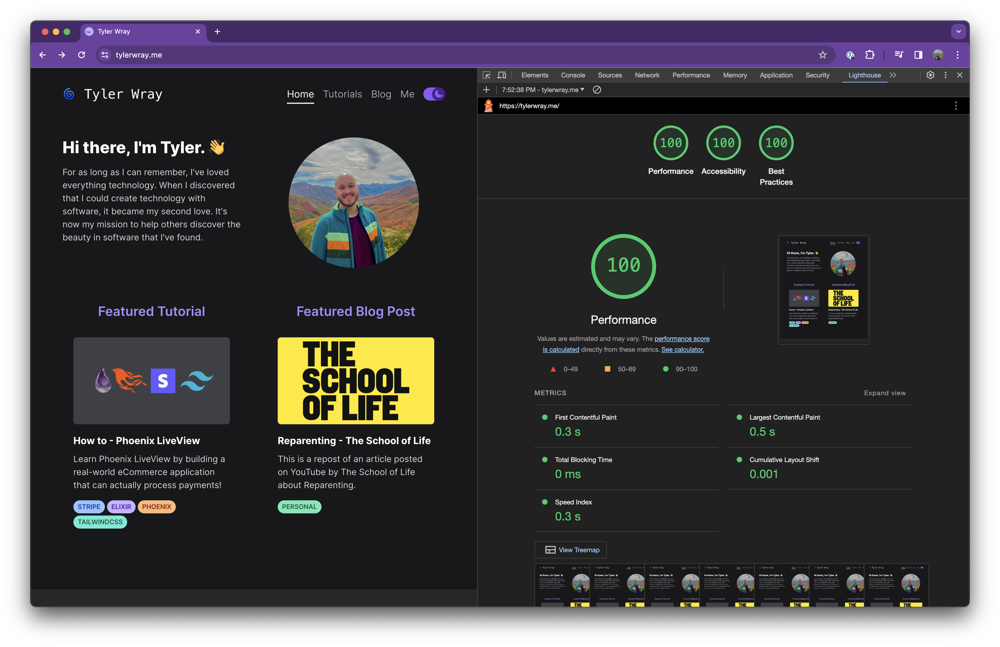

"Rewrite it in Rust" has become a great software development meme in the world today, and for good reason.

In this article I'm going not going to convince you to use rust, but rather to —

<b>"Rebuild it with Astro" 😍</b>

This is a story of my experience building and maintaining this blog with Gatsby, switching to Astro, and falling in LOVE.

---

# Prior to Astro

For years [Gatsby](https://www.gatsbyjs.com/) was my default web application framework. Gatsby was the tool
I'd reach for when I wanted a simple and performant application that could be extend when I needed.
Over time however, maintenence of my Gatsby applications was difficult. I'd revisit a project and needed to
re-learn Gatsby. Certain features of Gatsby began to feel like an unnecessary burden in each project.
GraphQL specifically made it difficult to easily jump back into a project.

About a year ago I set out to build a [multi-stage tutorial](https://tylerwray.me/tutorials/phoenix-live-view-ecommerce/)
that someone could follow piece-by-piece to understand a new technology. I dug into my blog, then written in Gatsby,
and felt the same pain of re-learning I had on other projects. I needed something new.

Some time ago I had built a bespoke internal engineering documentation application at work and during that process
a co-worker had mentioned we should use [Astro](https://astro.build/) (thanks Arthur!). Astro was so new
(prior 1.0) and the concepts were so unfamiliar we decided against it and used Gatsby instead. When I was looking
for something new for my blog that suggestion for Astro popped into my brain and I decided to checkout Astro further.
Astro had just released 1.0 and as I dug in I was blown away. Islands architecture,
content first principles, loads of official plugins for all the tech I used. Astro felt special, I decided to give it a shot.

Thanks to git you can browse the gatsby version of this blog on [github](https://github.com/tylerwray/me/tree/e468907245faf571ad61bcd07c5b58f95cd8a055)!

# Switching to Astro

Switching to Astro was very quick due to it's JSX and markdown support. Astro's Island Architecture helped
me ship a small but complex piece of my blog using React, while keeping everythign else 100% static.
I had used a few Gatsby specific plugins which took time to convert. Code blocks were the most complex part
(check out my [tutorial](https://tylerwray.me/tutorials/rich-md-code-blocks/) for more details). I ended up using
[Shiki](https://shiki.matsu.io/) and have loved the results.

After moving to Astro, deployment was very easy because I was just serving static content! My site
ended up being ~20% faster because the content was truly static and didn't require React runtime to be sent
to the browser due to Astro's glorious Islands Architecture.

Upon first switching to Astro, I thought I needed React in my posts so my site was all MDX pages. Turns out
I didn't really using MDX. Astro components and plain markdown was plenty for what I needed, and MDX is
actually way slower in development.

# Where I'm at today

My favorite part of Astro is the simplicity. Complexity is only introduced when I need it, like for my custom code blocks.
No need for GraphQL, just use the file system. All my plugins for react, tailwind, and sitemap generation are maintained
by the Astro core team. Updates to astro itself and the official plugins have been seamless! I'm already on
Astro 4.0 and each upgrade was very easy with clear migration paths. Not to mention all the other goodies like 
first class Typescript support, content schemas, built-in markdown support with frontmatter, and so much more.

Astro's developer experience is top notch, but what about performance? That's the best part, it's performant by
default! This is my site today with virtually no effort put into performance —

Oh how naive I was to use Gatsby for so many apps the past. Astro is now my default framework for content rich sites.

