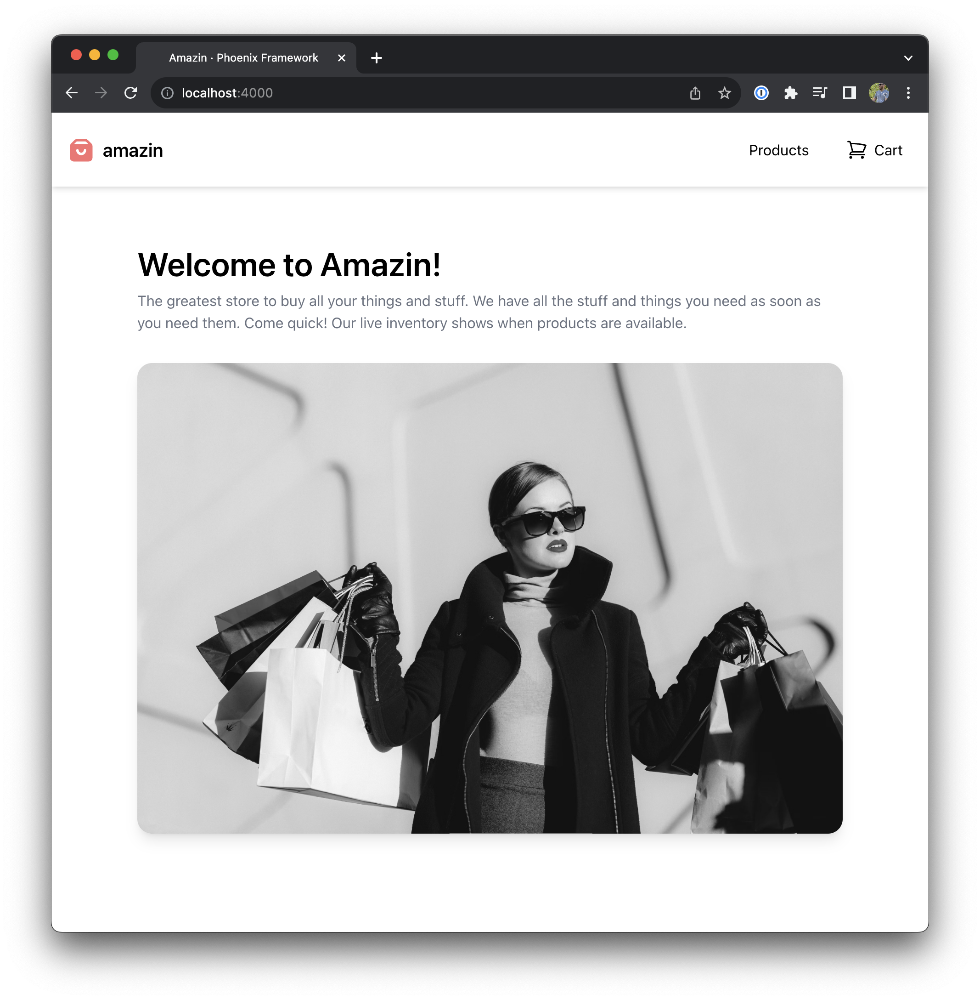

## Home Page

Replace the contents of `lib/amazin_web/controllers/page_html/home.html.heex` with —

```heex
---
title: lib/amazin_web/controllers/page_html/home.html.heex
---

<div class="container mx-auto py-4 grid max-w-4xl">
  <h1 class="text-4xl font-semibold pb-2">Welcome to Amazin!</h1>

  <p class="text-gray-500 pb-8">
    The greatest store to buy all your things and stuff. We have all the stuff and things you need as soon as you need them.
    Come quick! Our live inventory shows when products are available.
  </p>

  
</div>
```

## Navbar

We are going to create a basic navbar that will be present on each page, and a root path (`/`) home page

First thing we need to do is setup our root layout properly. And that starts with
adding our nice navbar.

In our `app.html.heex` file replace the contents of the `heex__<body />` tag so it looks like this —

```heex
---
title: lib/amazin_web/templates/layout/app.html.heex
---

<nav class="shadow-md fixed z-10 w-full bg-white h-20">
  <div class="px-4 h-full grid grid-cols-[1fr_auto_auto] gap-4 justify-center items-center">
    <a class="flex items-center gap-2" href="/">
      <svg
        xmlns="http://www.w3.org/2000/svg"
        fill="currentColor"
        viewBox="0 0 30 30"
        class="w-8 h-8 text-red-400"
      >
        <path d="m0 0h30.78v30.78h-30.78z" opacity="0" />
        <path d="m25.8039 8.605575-3.629475-3.629475c-.720854-.72175246-1.6988234-1.12770198-2.7189-1.1286h-8.13105c-1.0200766.00089802-1.99804595.40684754-2.7189 1.1286l-3.629475 3.629475c-.72175246.72085405-1.12770198 1.6988234-1.1286 2.7189v11.760525c0 2.1249156 1.72258443 3.8475 3.8475 3.8475h15.39c2.1249156 0 3.8475-1.7225844 3.8475-3.8475v-11.760525c-.000898-1.0200766-.4068475-1.99804595-1.1286-2.7189zm-10.4139 11.914425c-2.8332208 0-5.13-2.2967792-5.13-5.13 0-.7083052.5741948-1.2825 1.2825-1.2825s1.2825.5741948 1.2825 1.2825c0 1.4166104 1.1483896 2.565 2.565 2.565s2.565-1.1483896 2.565-2.565c0-.7083052.5741948-1.2825 1.2825-1.2825s1.2825.5741948 1.2825 1.2825c0 2.8332208-2.2967792 5.13-5.13 5.13zm-7.169175-11.5425 2.193075-2.193075c.2457703-.234356.5710113-.36720092.910575-.371925h8.13105c.3395637.00472408.6648047.137569.910575.371925l2.193075 2.193075z" />
      </svg>
      <div class="font-semibold text-xl">amazin</div>
    </a>

    <a href="/products" class="px-3 py-2 rounded hover:bg-gray-200">
      Products
    </a>
    <a href="/cart" class="px-3 py-2 rounded hover:bg-gray-200 grid grid-cols-2">
      <svg
        xmlns="http://www.w3.org/2000/svg"
        fill="none"
        viewBox="0 0 24 24"
        stroke-width="1.5"
        stroke="currentColor"
        class="w-6 h-6"
      >
        <path
          stroke-linecap="round"
          stroke-linejoin="round"
          d="M2.25 3h1.386c.51 0 .955.343 1.087.835l.383 1.437M7.5 14.25a3 3 0 00-3 3h15.75m-12.75-3h11.218c1.121-2.3 2.1-4.684 2.924-7.138a60.114 60.114 0 00-16.536-1.84M7.5 14.25L5.106 5.272M6 20.25a.75.75 0 11-1.5 0 .75.75 0 011.5 0zm12.75 0a.75.75 0 11-1.5 0 .75.75 0 011.5 0z"
        />
      </svg>
      Cart
    </a>
  </div>
</nav>
<main class="pt-20">
  <.flash_group flash={@flash} />
  <div class="p-8">
    <%= @inner_content %>
  </div>
</main>
```

Next update the `PageController` so it uses your layout —

```diff
---
title: lib/amazin_web/controllers/page_controller.ex
---

defmodule AmazinWeb.PageController do
  use AmazinWeb, :controller

  def home(conn, _params) do
-   render(conn, :home, layout: false)
+   render(conn, :home)
  end
end

```

Put it all together and you should be looking at something like this —


