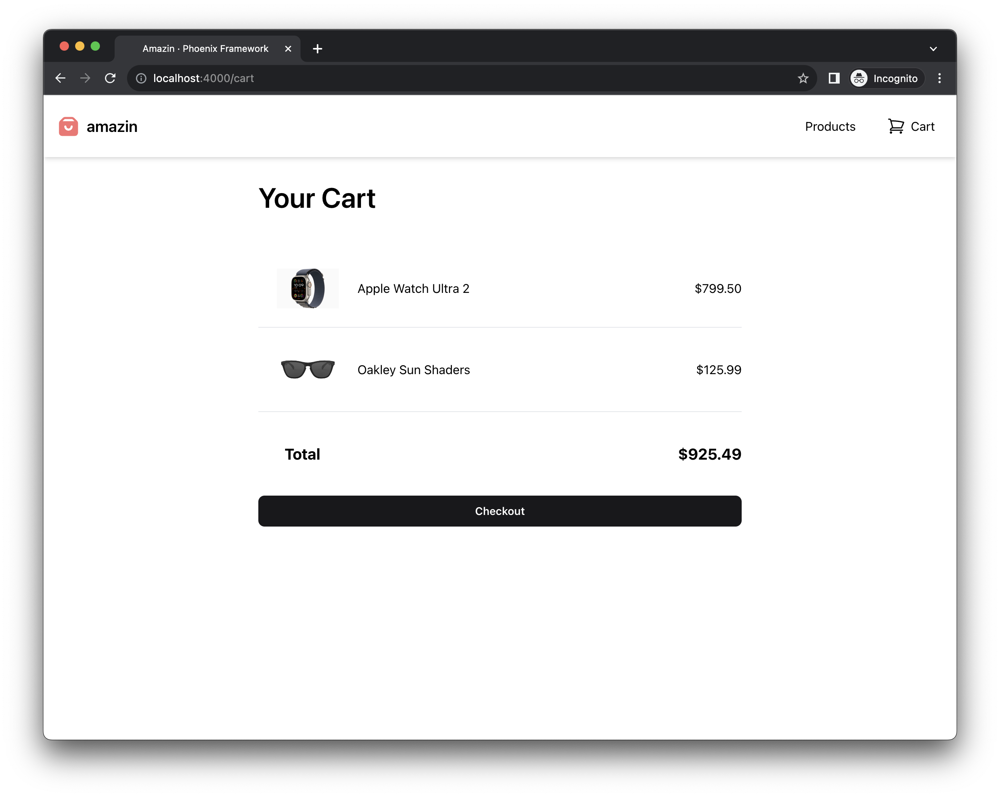

Earlier we added our HTML for our products page and you may have noticed on our `Add to cart` button we included
a `phx-click="add_to_cart"` attribute. This set us up to handle that button click in elixir, and manage a cart full of products!

## Add to cart

Using the awesome powers of phoenix generators again, we're going to create a few schemas for our cart.

We're going to create a `Cart` schema that will have many `CartItem`'s describing one `Product`.

First create our `Cart` schema —

```bash
mix phx.gen.schema Store.Cart carts status:enum:open:abandoned:completed
```

Then create our `CartItem` schema -

```bash
mix phx.gen.schema Store.CartItem cart_items cart_id:references:carts product_id:references:products quantity:integer
```

Add a unique constraint to our `cart_items` migration so we can increment `quantity` later —

```diff
defmodule Amazin.Repo.Migrations.CreateCartItems do
  use Ecto.Migration

  def change do
    create table(:cart_items) do
      add :quantity, :integer
      add :cart_id, references(:carts, on_delete: :nothing)
      add :product_id, references(:products, on_delete: :nothing)

      timestamps()
    end

    create index(:cart_items, [:cart_id])
    create index(:cart_items, [:product_id])
+   create unique_index(:cart_items, [:cart_id, :product_id])
  end
end
```

Remember to migrate the DB to keep it up-to-date —

```bash
mix ecto.migrate
```

We need to add a query to list our cart items for our cart live view.

Update the `CartItem` schema to describe it's association to `Product` so we can write a simpler query —

```diff
defmodule Amazin.Store.CartItem do
  use Ecto.Schema
  import Ecto.Changeset

+ alias Amazin.Store.Product

  schema "cart_items" do
    field :quantity, :integer
    field :cart_id, :id
-   field :product_id, :id
+   belongs_to :product, Product

    timestamps()
  end
end
```

Then add the needed context functions to the `Amazin.Store` content —

```elixir
defmodule Amazin.Store do
  # ... Removed for brevity

  alias Amazin.Store.Cart

  @doc """
  Create a cart.

  ## Examples

      iex> create_cart()
      {:ok, %Cart{}}

  """
  def create_cart do
    Repo.insert(%Cart{status: :open})
  end

  @doc """
  Get a cart by id.

  ## Examples

      iex> get_cart(1)
      %Cart{}

  """
  def get_cart(id) do
    Repo.get(Cart, id)
  end

  alias Amazin.Store.CartItem

  @doc """
  List products in a cart.

  ## Examples

      iex> list_cart_items(344)
      [%CartItem{}, %CartItem{}]
  """
  def list_cart_items(cart_id) do
    CartItem
    |> where([ci], ci.cart_id == ^cart_id)
    |> preload(:product)
    |> Repo.all()
  end

  @doc """
  Add a product to a cart. Increments quantity on conflict.

  ## Examples

      iex> add_item_to_cart(1, %Product{})
      {:ok, %Product{}}
  """
  def add_item_to_cart(cart_id, product) do
    Repo.insert(%CartItem{cart_id: cart_id, product: product, quantity: 1},
      conflict_target: [:cart_id, :product_id],
      on_conflict: [inc: [quantity: 1]]
    )
  end
end
```

We need to ensure that a valid cart is always available for users. To do this, we're going to write a custom plug —

```elixir
---
title: lib/amazin_web/plugs/session_cart.ex
---

defmodule AmazinWeb.Plugs.SessionCart do
  @moduledoc """
  Plug to ensure an open cart is assigned to the session.
  """
  @behaviour Plug

  import Plug.Conn

  alias Amazin.Store

  @impl true
  def init(default), do: default

  @impl true
  def call(conn, _config) do
    case get_session(conn, :cart_id) do
      nil ->
        {:ok, %{id: cart_id}} = Store.create_cart()
        put_session(conn, :cart_id, cart_id)

      cart_id ->
        case Store.get_cart(cart_id) do
          %{status: :open} ->
            conn

          _cart ->
            {:ok, %{id: cart_id}} = Store.create_cart()
            put_session(conn, :cart_id, cart_id)
        end
    end
  end
end
```

Then in your router, add it to the `:browser` pipeline —

```diff
---
title: lib/amazin_web/router.ex
---
defmodule AmazinWeb.Router do
  use AmazinWeb, :router

  pipeline :browser do
    plug :accepts, ["html"]
    plug :fetch_session
    plug :fetch_live_flash
    plug :put_root_layout, html: {AmazinWeb.Layouts, :root}
    plug :protect_from_forgery
    plug :put_secure_browser_headers
+   plug AmazinWeb.Plugs.SessionCart
  end

  # ... Removed for brevity
end
```

Next let's wire up our product live view to handle adding items to a cart in the session.
Replace the `mount` function, add a new `handle_info/2` function, and add the `handle_event/3` function for adding to cart —

```elixir
defmodule AmazinWeb.ProductLive.Index do
  # ... Removed for brevity

  @impl true
  def mount(_params, session, socket) do
    if connected?(socket), do: Store.subscribe_to_product_events()

    socket =
      socket
      |> assign(:cart_id, session["cart_id"])
      |> stream(:products, Store.list_products())

    {:ok, socket}
  end

  # ... Removed for brevity

  @impl true
  def handle_info(:clear_flash, socket) do
    {:noreply, clear_flash(socket)}
  end

  # ... Removed for brevity

  @impl true
  def handle_event("add_to_cart", %{"id" => id}, socket) do
    product = Store.get_product!(id)

    Store.add_item_to_cart(socket.assigns.cart_id, product)

    Process.send_after(self(), :clear_flash, 2500)

    {:noreply, socket |> put_flash(:info, "Added to cart")}
  end
end
```

Note how we pattern match on the name of the `phx-click` attribute, and we receive a map of any `phx-value-*` attributes.
On our button, we also added a `phx-value-id` attribute which is set to each respective product id.

We're now ready to build our cart UI!

## Cart Live View

The cool thing I've realized about live-view is even though I don't have any "live" parts to this cart page,
it's still fine to build as a live-view because the overhead is minimal, and the semantics are awesome.

First thing we need to do is add a few routes pointing to some live-view's we are going to create —

```diff
scope "/", AmazinWeb do
  pipe_through :browser

  get "/", PageController, :index
  live "/products", ProductLive.Index, :index
  live "/products/:id", ProductLive.Show, :show
+ live "/cart", CartLive.Show, :index
+ live "/cart/success", CartLive.Success, :index
end
```

Next let's add a basic live view for the cart —

```elixir
---
title: lib/amazin_web/live/cart_live/show.ex
---
defmodule AmazinWeb.CartLive.Show do
  use AmazinWeb, :live_view

  alias Amazin.Store

  @impl true
  def mount(_params, session, socket) do
    cart_items = Store.list_cart_items(session["cart_id"])

    total =
      cart_items
      |> Enum.map(fn ci -> ci.product.amount * ci.quantity end)
      |> Enum.sum()
      |> Money.new()

    socket =
      socket
      |> assign(:cart_id, session["cart_id"])
      |> assign(:total, total)
      |> stream(:cart_items, cart_items)

    {:ok, socket}
  end

  @impl true
  def handle_params(_params, _url, socket) do
    {:noreply, socket}
  end
end
```

And then the HTML —

```heex
---
title: lib/amazin_web/live/cart/show.html.heex
---
<div class="grid grid-cols-1 px-6 max-w-2xl mx-auto" id="cart_items" phx-update="stream">
  <h1 class="text-4xl pb-12 font-semibold">Your Cart</h1>
  <div
    :for={{dom_id, cart_item} <- @streams.cart_items}
    id={dom_id}
    class="cursor-pointer grid grid-cols-[8rem_1fr_auto] items-center border-b"
    phx-click={JS.navigate(~p"/products/#{cart_item.product}")}
  >
    
    <div>
      <%= cart_item.product.name %>
    </div>
    <div>
      <%= Money.new(cart_item.product.amount * cart_item.quantity) %>
    </div>
  </div>

  <div class="grid grid-cols-[5rem_auto] items-center py-10">
    <div class="font-bold text-xl text-right">Total</div>
    <div class="font-bold text-xl text-right">
      <%= @total %>
    </div>
  </div>

  <.button phx-click="checkout">
    Checkout
  </.button>
</div>
```

To test it out, let's add some items to our cart from the products page, then click the cart icon and....



Amazing. Now we're ready for the final strech.

_Finished application on [github](https://github.com/tylerwray/amazin)._
