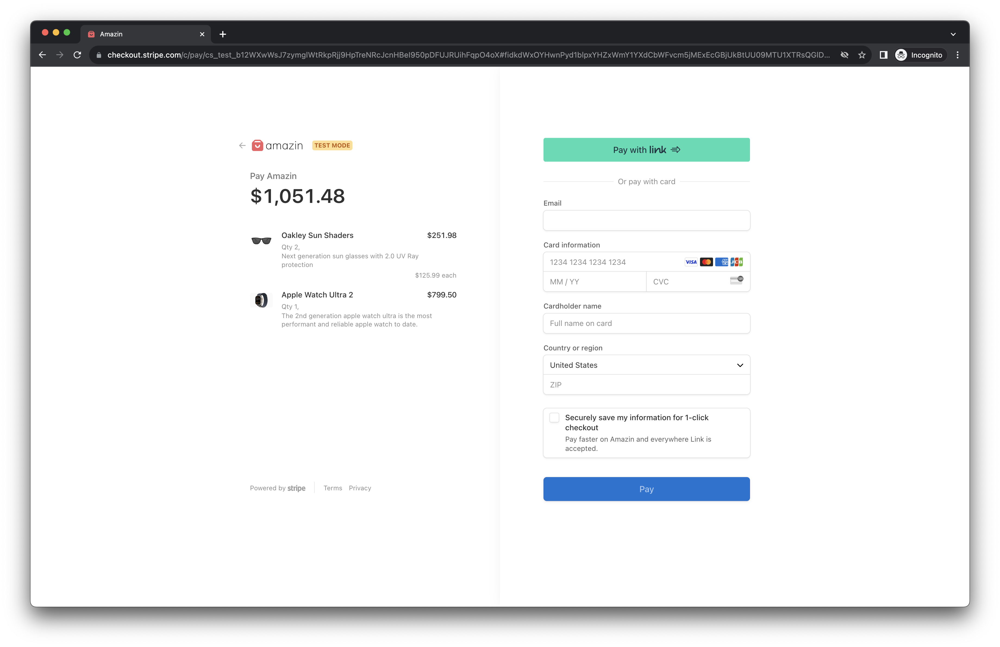
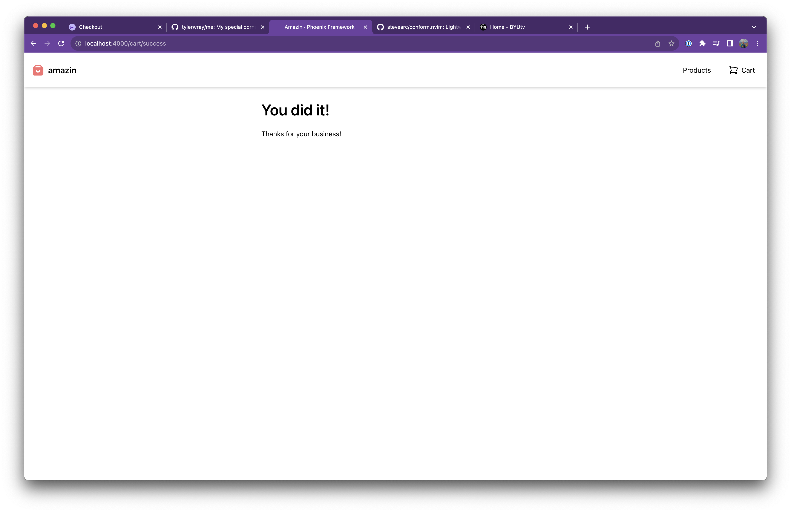

We're in the final stretch! We need to implement the checkout experience, then
we are done. Luckily, most of it is handled by stripe. 😎

In our data model, completing a checkout will result in an `Order`.

Lets create our `Order` entity —

```bash
mix phx.gen.schema Store.Order orders cart_id:references:carts
```

Remember to migrate the DB to keep it up-to-date —

```bash
mix ecto.migrate
```

Then we need to add a `create_order/1` function to our store context so we can create the order record, completing our checkout.

```elixir
defmodule Amazin.Store do
  # ... Removed for brevity

  alias Amazin.Store.Order

  @doc """
  Create an order and complete a cart.

  ## Examples

      iex> crate_order(1)
      {:ok, %Order{}}
  """
  def create_order(cart_id) do
    cart_id
    |> get_cart()
    |> Cart.changeset(%{status: :completed})
    |> Repo.update()

    Repo.insert(%Order{cart_id: cart_id})
  end
end
```

## Success page

We need a success page to send users once they complete their checkout.

```elixir
---
title: lib/amazin_web/live/cart_live/success.ex
---
defmodule AmazinWeb.CartLive.Success do
  @moduledoc """
  Success live view.
  """

  use AmazinWeb, :live_view

  alias Amazin.Store

  @impl true
  def mount(_params, session, socket) do
    cart = Store.get_cart(session["cart_id"])

    {:ok, assign(socket, :cart, cart)}
  end

  @impl true
  def render(assigns) do
    ~H"""
    <div class="grid grid-cols-1 px-6 max-w-2xl mx-auto" id="cart_items" phx-update="stream">
      <h1 class="text-4xl pb-6 font-semibold">You did it!</h1>
      <p>Thanks for your business!</p>
    </div>
    """
  end
end
```

## Checkout button

Next we need to add a handler for our checkout button that sends the right data to stripe so users can make a payment.

```elixir
defmodule AmazinWeb.CartLive.Show do
  # ... Removed for brevity

  @impl true
  def handle_event("checkout", _params, socket) do
    cart_items = Store.list_cart_items(socket.assigns.cart_id)

    line_items =
      Enum.map(cart_items, fn ci ->
        %{
          price_data: %{
            currency: "usd",
            product_data: %{
              name: ci.product.name,
              description: ci.product.description,
              images: [ci.product.thumbnail]
            },
            unit_amount: ci.product.amount
          },
          quantity: ci.quantity
        }
      end)

    {:ok, checkout_session} =
      Stripe.Checkout.Session.create(%{
        line_items: line_items,
        mode: :payment,
        success_url: url(~p"/cart/success"),
        cancel_url: url(~p"/cart"),
        metadata: %{"cart_id" => socket.assigns.cart_id}
      })

    {:noreply, redirect(socket, external: checkout_session.url)}
  end
end
```

## Webhooks

The most reliable way to know if a stripe checkout was completed is to listen to a webhook from stripe.

Luckily, setting one up is pretty easy.

First we add a stripe webhook handler module —

```elixir
---
title: lib/amazin_web/stripe_webhook_handler.ex
---
defmodule AmazinWeb.StripeWebhookHandler do
  @moduledoc """
  Stripe webhook handler.
  """
  @behaviour Stripe.WebhookHandler

  alias Amazin.Store

  @impl true
  def handle_event(%Stripe.Event{type: "checkout.session.completed"} = event) do
    cart_id = String.to_integer(event.data.object.metadata["cart_id"])
    Store.create_order(cart_id)

    :ok
  end

  # Return HTTP 200 for unhandled events
  @impl true
  def handle_event(_event), do: :ok
end
```

Then we need to add our webhook secret key to our configuration.

Forward stripe webhooks and you'll see this command will print our your webhook secret —

```bash
stripe listen --forward-to http://localhost:4000/webhooks/stripe
```

Take that webhook secret and add it to the dev secret config —

```elixir
---
title: config/dev.secret.exs
---

import Config

config :stripity_stripe, api_key: "YOUR_SECRET_KEY"

config :amazin, stripe_webhook_secret: "YOUR_WEBHOOK_SECRET"
```

Then we add the `Stripe.Webhook` plug from our stripe library to `endpoint.ex` —

```elixir
---
title: lib/amazin_web/endpoint.ex
---
plug Stripe.WebhookPlug,
  at: "/webhooks/stripe",
  handler: AmazinWeb.StripeWebhookHandler,
  secret: Application.compile_env(:amazin, :stripe_webhook_secret)

# Make sure this goes before `Plug.Parsers`
```

Now we're ready to test out the full checkout flow!

## Testing it all out

Start up your app —

```bash
mix phx.server
```

Forward webhooks —

```bash
stripe listen --forward-to http://localhost:4000/webhooks/stripe
```

Open the app and add items to the cart. Visit the cart and click Checkout, you should be redirected to the stripe checkout page!



Fill out the checkout page and submit, you should be redirected to your success page!



And if you peek at your DB, you'll see an order record was created and the cart was marked as `completed`.

You are done! You've built a completely functional eCommerce app in Phoenix Live View. 👏

_Finished application on [github](https://github.com/tylerwray/amazin)._